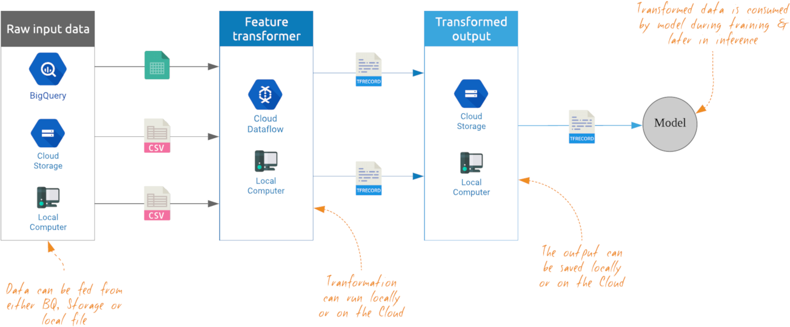

# Data Prepprocessing Guide

This document provides implementation guide for *data transformation* using
[TensorFlow Transform](https://www.tensorflow.org/tfx/transform/get_started)
based on [Apache Beam](https://beam.apache.org/), which can run both locally or
on the [Cloud Dataflow](https://cloud.google.com/dataflow/). Input data to
transformer can be either CSV file or BigQuery table as shown in the graph:



To run the pipeline, you need to do 2 steps: 1. Setup the environment 2. Run the
pipeline

Following shows how to setup environment based on input source, either CSV or
BigQuery table.

## Step 1: Setting up environment

Before running the pipeline, you need to setup the envorinment. There are two
scenarios based on input data source.

### Case 1: Input data is CSV

```bash
PROJECT=<gcp_project_id>
RUNNER=<runner>
JOB_NAME=<unique_job_name_for_cloud_dataflow>
DATA_SOURCE=csv
ALL_DATA=<path_to_all_data.csv>
TRAIN_DATA=<path_to_train_data.csv>
EVAL_DATA=<path_to_eval_data.csv>
PREDICT_DATA=<path_to_predict_data.csv>
TRANSFORM_DIR=<path_to_store_transformer_files>
OUTPUT_DIR=<path_to_store_transformed_files>
```

DESCRIPTION:

*   `PROJECT`: Google Cloud Platform project id that you can get from
    [Google Cloud Console](https://console.cloud.google.com).
*   `RUNNER`: Indicates where to run the data transformation pipeline. If you
    want to run on the Cloud Dataflow, set the value to `DataflowRunner`.
    Otherwise, set it to `DirectRunner` to run locally.
*   `JOB_NAME`: Job name for pipeline to run on Cloud DataFlow.
*   `DATA_SOURCE`: Indicates where input data comes from. Current version
    supports two options: `csv` or `bigquery`.

Following four variables are input data sources. They can be local CSV files or
CSV files on Cloud Storage. If local CSV, indicate relative path:
`<path/to/file.csv>`. If CSV is stored in Cloud Storage, indicate full storage
bucket path: `gs://bucket/file.csv`

*   `ALL_DATA`: CSV containing all data.
    [Data schema](https://www.tensorflow.org/tfx/transform/get_started#data_formats_and_schema)
    is inferred automatically based on this and saved as proto buffer file,
    which is used during transormation process and inference time.
*   `TRAIN_DATA`: CSV containing only training data.
*   `EVAL_DATA`: CSV containing only eval data.
*   `PREDICT_DATA`: CSV containing only predict data.
*   `TRANSFORM_DIR`: Path to local directory or Cloud Storage path to store
    [TensorFlow transform model](https://www.tensorflow.org/tfx/transform/get_started)
    and related files created during transformation process.
*   `OUTPUT_DIR`: Directory path transformed data will be saved. It can be local
    directory or Cloud Storage folder.

EXAMPLE:

```bash
PROJECT=my-cloud-project
RUNNER=DirectRunner
JOB_NAME=transoform-job
DATA_SOURCE=csv
ALL_DATA=workflow/dags/tasks/preprocess/test_data/data_all.csv
TRAIN_DATA=workflow/dags/tasks/preprocess/test_data/data_train.csv
EVAL_DATA=workflow/dags/tasks/preprocess/test_data/data_eval.csv
PREDICT_DATA=workflow/dags/tasks/preprocess/test_data/data_predict.csv
TRANSFORM_DIR=~/sample_output/transformer
OUTPUT_DIR=~/sample_output/dataset
```

### Case 2: Input data is BigQuery table:

All environment variables are similar to above setup, except for following.
`DATA_SOURCE` needs to be set to `bigquery`. All data path variables need to
indicate full path to BigQuery table.

```bash
DATA_SOURCE=bigquery
ALL_DATA=$PROJECT.<dataset_name>.<table_name_for_all data>
TRAIN_DATA=$PROJECT.<dataset_name>.<table_name_for_training>
EVAL_DATA=$PROJECT.<dataset_name>.<table_name_for_evaluation>
PREDICT_DATA=$PROJECT.<dataset_name>.<table_name_for_prediction>
```

## Step 2: Run the pipeline

There are two options you can run the pipeline: locally or on the Cloud.

### Option 1: Run the pipeline locally

In order to run locally, set the RUNNER variable to DirectRunner:
`RUNNER=DirectRunner`.

NOTE: All input data and output directories can be *either local or Cloud
Storage bucket*.

```bash
python workflow/dags/tasks/preprocess/transformer.py \
  --project $PROJECT \
  --runner $RUNNER \
  --job_name $JOB_NAME \
  --all-data $ALL_DATA \
  --train-data $TRAIN_DATA \
  --eval-data $EVAL_DATA \
  --predict-data $PREDICT_DATA \
  --transform-dir $TRANSFORM_DIR \
  --output-dir $OUTPUT_DIR \
  --data-source $DATA_SOURCE
```

### Option 2: Run on Cloud DataFlow

In order to run on the Cloud, set RUNNER to DataflowRunner:
`RUNNER=DataflowRunner`.

NOTE: All input data and output directories *should be on Cloud Storage bucket*.

```bash
python -m workflow.dags.tasks.preprocess.transformer \
  --project $PROJECT \
  --runner $RUNNER \
  --job_name $JOB_NAME \
  --all-data $ALL_DATA \
  --train-data $TRAIN_DATA \
  --eval-data $EVAL_DATA \
  --predict-data $PREDICT_DATA \
  --transform-dir $TRANSFORM_DIR \
  --output-dir $OUTPUT_DIR \
  --data-source $DATA_SOURCE
```

## Other options

Above runs will transform whole dataset: train, eval, predict. But during
inference time, you may only need transformation only for prediction data. To do
so, supply additional `--mode=predict` flag. If set, only `PREDICT_DATA`
environment variable needs to have path to data. Others (`TRAIN_DATA`,
`EVAL_DATA`) can be set to None.

## Next steps

When data transformation is finished, you can move to modeling step -
[Model Training Guide](../../../../trainer/README.md).
